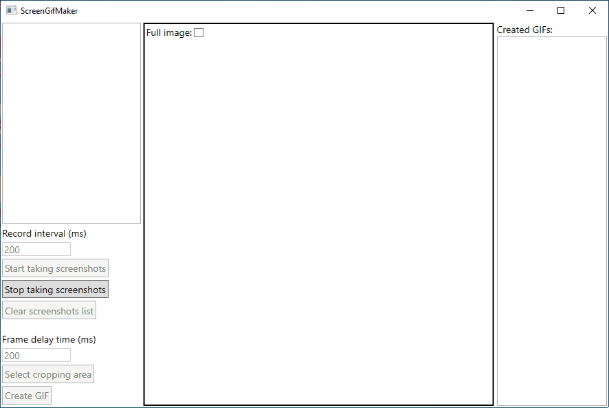

# Screen-Gif-Maker
WPF app for creating GIFs from screenshots.
## How to use:
* Start taking screenshots with given time interval
* Skip or move selected frames
* Set animation interval
* Select cropping area or don't select at all
* Hit the button "Create GIF"
* Wait for animation to be created
* When process is done, you can open the file
* Enjoy the result
## Demonstration

## Libraries:
* [UI-Cropping-Image](https://github.com/dmitryshelamov/UI-Cropping-Image)
* [NGif](https://www.codeproject.com/Articles/11505/NGif-Animated-GIF-Encoder-for-NET)
* [System.Drawing.Common](https://www.nuget.org/packages/System.Drawing.Common/)
* [Microsoft.Tookit.Mvvm](https://github.com/CommunityToolkit/WindowsCommunityToolkit)
